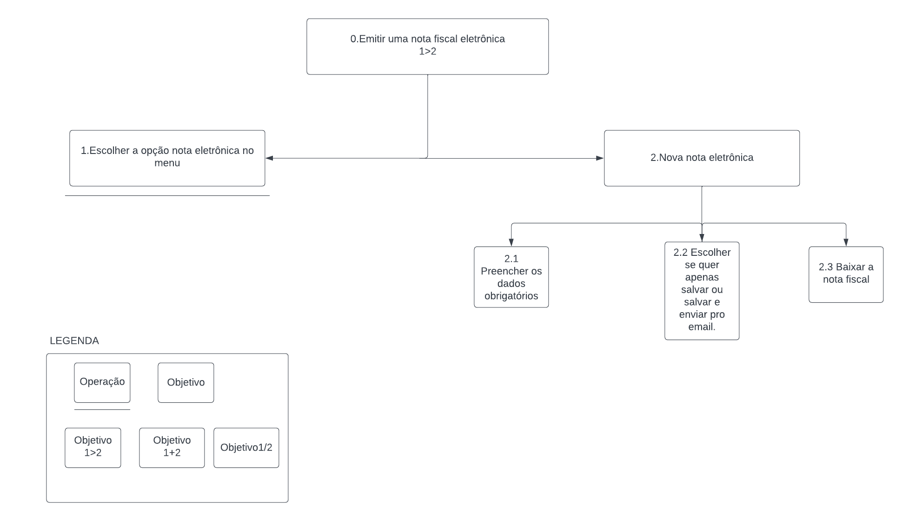
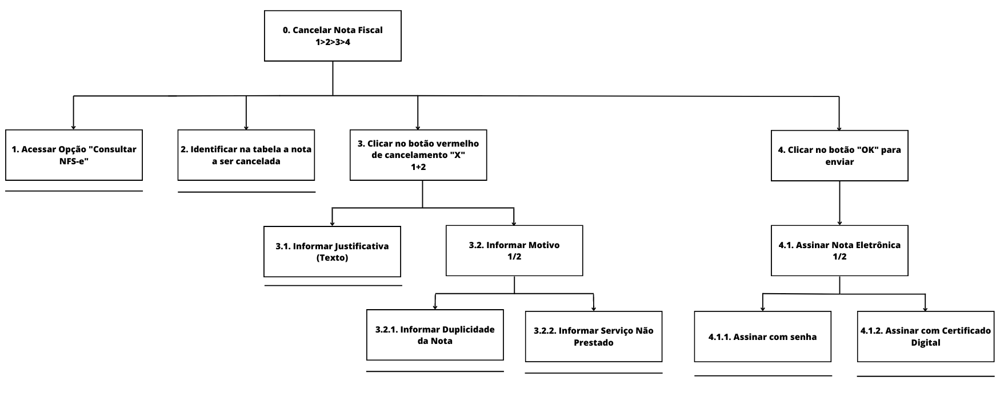

# Análise de Tarefas
## Introdução
 A análise de tarefas é um método utilizado na área de Interação Humano-Computador para compreender qual o trabalho dos usuários, como eles o realizam e por que o fazem.Nesse contexto, o trabalho é definido como os objetivos que os usuários buscam alcançar ao realizar uma atividade <a href="#simone">[1]</a>. Essa análise é fundamental para o design e avaliação de sistemas interativos, pois ajuda a garantir que esses sistemas sejam projetados para atender às necessidades e objetivos dos usuários e para facilitar suas tarefas e atividades diárias.

 A análise de tarefas pode ser usada em diferentes atividades, como a análise da situação atual, o design de um novo sistema computacional ou a avaliação de um sistema existente. Neste artefato, apresentamos uma análise de tarefas para um sistema já implementado e em uso, o que torna a análise mais viável e os seus resultados mais confiáveis.

 Com o intuito de explorar diferentes técnicas, foram avaliadas as tarefas de "Emitir nota fiscal eletrônica" e "Consultar nota eletrônica" por meio de duas metodologias diferentes, a saber: Análise Hierárquica de Tarefas (HTA) e GOMS (Goals, Operators, Methods and Selection Rules). As tarefas selecionadas compõem as duas funcionalidades mais utilizadas pelos usuários do aplicativo, conforme apontam os dados coletados durante a elaboração do [perfil do usuário](perfil_de_usuario.md).

## Análise Hierárquica de Tarefas (HTA)

Essa metodologia foi desenvolvida na década de 60, com o objetivo de entender habilidades e competências presentes na execução de tarefas complexas e não repetitivas e auxiliar na identificação de problemas de desempenho. Seu enfoque encontra-se em relacionar o que as pessoas fazem, suas motivações e consequências de suas tarefas.

A análise hierárquica de tarefas possui os seguintes elementos:

> **Tarefa**: qualquer parte de um trabalho a ser realizado;
>
> **Objetivo**: um estado final, que pode ser definido por eventos ou valores fisicamente observáveis;
>
> **Subobjetivo**: um objetivo de alto nível é dividido em subobjetivos, por exemplo o objetivo "Emitir nota fiscal" possui, dentre outros, os seguintes subobjetivos: "Preencher o documento que comprova o serviço prestado";
>
> **Plano**: o conjunto de subobjetivos de um objetivo e suas relações consiste em um plano;
>
> **Operação**: circunstâncias de ativação do objetivo (_input_ ou entrada), atividades ou ações (_actions_) para alcançá-lo e condições que indicam seu atingimento (_feedback_)
>

A análise hierárquica de tarefas pode ser representada na forma textual, por meio de uma tabela, por exemplo, ou por um diagrama. No segundo caso, utiliza-se a notação representada na Figura 1.

*Figura 1: Elementos do diagrama*

*Fonte: Simone, 2010*

### Análise da Tarefa: Emitir Nota Fiscal Eletrônica
A tarefa "Emitir nota fiscal eletrônica" é uma das principais tarefas que o usuario realiza no sistema, já que é uma funcionalidade principal. A tabela 1 e a figura 2 apresentam a análise hierárquica dessa tarefa em sua forma textual e de diagrama, respectivamente.

*Tabela 1: Análise Hierárquica de Tarefas para o objetivo "Emitir nota fiscal"*

| Objetivos/Operações | Problemas e recomendações |
| - | - |
| 0. Emitir uma nota fiscal eletrônica  (1 > 2) | **input**: Realiza login na tela inicial da aplicação com cpf e senha ou certificado digital;   **feedback**: Tela com o menu inicial com as funcionalidades do sistema;   **plano**: Escolher a opção de Nota Eletrônica para abrir a modal de preenchimento dos dados;   **recomendação**: Permitir que o usuario consiga acessar a modal diretamente da página inicial. |
| 1. Escolher a opção Nota Eletrônica no menu | |
| 2. Nova nota eletrônica  | **plano**: opção do menu que abre a modal para preenchimento dos dados para emitir a nota fiscal eletrônica | |
| 2.1 Preencher os dados obrigatórios  | |
| 2.2 Escolher se quer apenas salvar ou salvar e enviar para o email | |
| 2.3 Baixar a nota fiscal   |  |

*Fonte: Autor, 2023*

*Figura 2: Análise Hierárquica da Tarefa Emitir Nota Fiscal*

*Fonte: Autor, 2023*

### Análise de Tarefa: Cancelar Nota Fiscal
A análise da tarefa de cancelar a nota fiscal, foi identificada no questionário do [perfil de usuário](https://interacao-humano-computador.github.io/2023.1-ISSNet/analise_de_requisitos/perfil_de_usuario/#questao-7) como sendo a 3º atividade mais utilizada pelo sistema, a análise HTA da tarefa está representada na tabela 2 e na figura 3

*Tabela 2: Análise Hierárquica da Tarefa Cancelar Nota Fiscal*

|Objetivos/Operações| Problemas e recomendações|
| - | - |
|0. Cancelar Nota Fiscal 1>2>3>4| **input:** nota a ser cancelada, com justificativa, motivo e assinatura  **feedback:** mensagem de registro gravado  **plano:** consultar tabela, em seguida identificar a nota a ser cancelada, informar justificativa e motivo (duplicidade da nota ou serviço não prestado), enviar e assinar solicitação (senha ou certificado digital)|
|1. Consultar NFS-e emitidas||
|2. Identificar nota a ser cancelada ||
|3. Cancelar Nota Identificada 1>2 |**plano:** informar a justificativa por texto e informar o motivo|
|3.1. Informar justificativa (texto) ||
|3.2. Informar Motivo 1/2|**input:** seleção entre duplicidade da nota ou serviço não prestado|
|3.2.1 Informar duplicidade de nota||
|3.2.2 Informar serviço não prestado||
|4. Enviar solicitação de cancelamento|**input:** assinatura da solicitação |
|4.1 Assinar solicitação 1/2|**plano:** assinar solicitação por meio de senha ou certificado digital|
|4.1.1. Assinar com senha||
|4.1.2. Assinar com certificado digital||

*Fonte: Autor, 2023*

*Figura 3: Análise Hierárquica da Tarefa Cancelar Nota Fiscal*

*Fonte: Autor, 2023*

## Objetivos, Operadores, Métodos e Regras de Seleção (GOMS)

De acordo com Barbosa et al <a href="#simone">[1]</a>, o conjunto de modelos GOMS (_Goals, Operators, Methods and Selection Rules_ - Objetivos, Operadores, Métodos e Regras de Seleção), visa analisar o desempenho de usuários competentes de sistemas computacionais realizando tarefas dentro de sua competência e sem cometer erros. Compõem a família de modelos GOMS algumas técnicas, dentre as quais a o modelo CMN-GOMS foi selecionado para a análise da tarefa emitir uma nota fiscal. Esse método representa as tarefas por meio de uma linguagem de pseudocódigo, indicando a ordem sequencial dos objetivos. Esse modelo visa prever a sequência dos operadores e o tempo de execução desempenhado em uma tarefa.

### Análise da Tarefa: Consultar Nota Eletrônica de Serviço

O modelo GOMS foi utilizado para analisar a tarefa "Consultar Nota Eletrônica", sendo o escopo de avaliação a situação em que um usuário desejar a partir da plataforma consultar uma nota fiscal de serviço eletrônica.

GOAL 0: Consultar Nota Fiscal Eletrônica

GOAL 1: Realizar login na plataforma

OP. 1.1: Digitar seu cpf e senha

OP. 1.2: Logar através do certificado digital 

GOAL 2:  Escolher a opção Consultar Nota Eletrônica

OP. 2.1: escolher a série 

OP. 2.2: preencher os Números da nota 

GOAL 3: Localizar a nota Fiscal 

OP. 3.1: Preencher ou não informações adicionais 

OP. 3.2: selecionar o botão de localizar 

## Referências
<!-- FONTES CITADAS UTILIZADAS PARA EMBASAR O TEXTO, REMOVER CASO NÃO HOUVER  -->
[1]: SIMONE DINIZ JUNQUEIRO BARBOSA, BRUNO SANTANA DA SILVA, Interação Humano-Computador, 1a.
Edição, Editora Campus, 2010. Publicado em: 03/05/2021.

<!-- ## Bibliografia -->
<!-- FONTES CONSULTADAS DURANTE A ELABORAÇÃO DO TEXTO, CITADAS OU NÃO -->

## Histórico de revisão

| Versão     | Data        | Descrição            | Autor(es)                          | Revisores      |
| :--------: | :---------: | -------------------- | ---------------------------------- | -------------- |
| `0.0`      |  06/05/2023 | Criação do arquivo   | Arthur Trindade                    | Miguel Moreira |
| `0.1`      |  07/05/2023 | Adição da introdução | Arthur Trindade                    | Miguel Moreira |
| `0.2`      |  08/05/2023 | Adição da Analise    | Gabriel de Souza Fonseca Ribeiro   | Arthur Trindade|
| `0.3`      |  20/05/2023 | Adição de Tarefa e Correções | Júlio César | Arthur Trindade |
| `0.4`      |  23/05/2023 | Corrige HTA Cancelar Nota    | Júlio César | Arthur Trindade |
| `0.5`      |  03/07/2023 | Adiciona introdução do cancelar nota | Júlio César | Arthur Trindade |