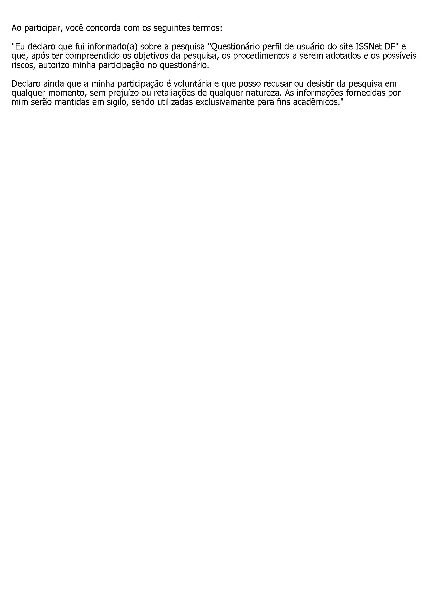

# Aspectos éticos de pesquisas envolvendo pessoas
## Introdução
A ética é um aspecto fundamental em qualquer pesquisa envolvendo pessoas, e em nosso projeto de refatoração de site não poderia ser diferente. Como alunos de engenharia de software, é nossa responsabilidade garantir que os participantes de nossa pesquisa sejam tratados com o respeito e a dignidade que merecem, e que suas informações sejam tratadas com a devida confidencialidade e segurança.

Para isso, seguimos os princípios recomendados pelo Conselho Nacional de Saúde na resolução Nº 466/2012, que orienta pesquisadores em todas as áreas a adotarem uma postura ética e cuidadosa no envolvimento de pessoas em suas pesquisas. Esses princípios incluem a autonomia, a beneficência, a não maleficência e a justiça e equidade, e são aplicáveis tanto na coleta de dados através de questionários quanto em outras etapas do processo de refatoração do site.

Nosso compromisso com a ética em nossa pesquisa é absoluto, e nos esforçamos para garantir que nossos participantes sejam tratados com o máximo de cuidado e respeito. Estamos empenhados em realizar um trabalho de qualidade, sem jamais comprometer a integridade e a dignidade dos envolvidos em nosso projeto.

## Termo de Consentimento
De acordo a resolução CNS nº 466 de 2012, o Termo de Consentimento Livre e Esclarecido (TCLE) é um documento no qual é explicitado o consentimento livre e esclarecido do participante e/ou de seu responsável legal, de forma escrita, devendo conter todas as informações necessárias, em linguagem clara e objetiva, de fácil entendimento, para o mais completo esclarecimento sobre a pesquisa a qual se propõe participar. O Termo de Consentimento Livre e Esclarecido é importante para garantir a participação voluntária e consciente na pesquisa, informando sobre os objetivos e possíveis riscos envolvidos. Desse modo, o objetivo deste termo é fornecer informações claras e objetivas sobre a pesquisa para que o participante possa tomar uma decisão informada sobre a sua participação no questionário. O termo será assinado anonimamente e de forma online para facilitar a logística da equipe:

<h3>
Termo de Consentimento Livre e Esclarecido
</h3>

 

Olá, tudo bom? 
Somos alunos da Universidade de Brasília e estamos fazendo uma avaliação do sistema ISSNet Online DF para a disciplina de Interação Humano-Computador. Nessa etapa da avaliação, estamos conduzindo uma pesquisa para definir as principais características dos usuários do sistema e como eles interagem com ele. Para isso, solicitamos sua participação nessa pesquisa, a fim de nos ajudar no desenvolvimento deste projeto. 
O questionário é bem rápido e leva cerca de 5 a 7 minutos para ser concluído. Suas respostas serão mantidas em total sigilo e utilizadas exclusivamente para fins acadêmicos. 
Ao participar, você concorda com os seguintes termos:  

*"Eu declaro que fui informado(a) sobre a pesquisa "Questionário perfil de usuário do site ISSNet DF" e que, após ter compreendido os objetivos da pesquisa, os procedimentos a serem adotados e os possíveis riscos, autorizo minha participação no questionário. *

*Declaro ainda que a minha participação é voluntária e que posso recusar ou desistir da pesquisa em qualquer momento, sem prejuízo ou retaliações de qualquer natureza. As informações fornecidas por mim serão mantidas em sigilo, sendo utilizadas exclusivamente para fins acadêmicos."*  

Desde já agradecemos a sua colaboração. Caso tenha alguma dúvida ou queira mais informações, não hesite em entrar em contato conosco através do e-mail arthur-catrindadeunb@hotmail.com.  

( ) Concordo &nbsp;&nbsp;&nbsp;&nbsp;&nbsp;&nbsp;&nbsp;&nbsp;&nbsp;&nbsp;&nbsp;&nbsp;&nbsp;&nbsp;&nbsp; ( ) Não concordo 

## Referências
[Conselho Nacional de Saúde]. Resolução Nº 466, de 12 de dezembro de 2012. Diário Oficial da União, Brasília, DF, 13 jun. 2013. Seção 1, p. 59-62. Disponível em: <http://conselho.saude.gov.br/resolucoes/2012/Reso466.pdf>. Acesso em: 7 mai. 2023.

## Termo de consentimento
 

## Bibliografia
<!-- FONTES CONSULTADAS DURANTE A ELABORAÇÃO DO TEXTO, CITADAS OU NÃO -->
Aspectos Éticos, Lichess. Disponível em:  <https://interacao-humano-computador.github.io/2022.2-Lichess/analise_requisitos/aspectos_eticos/>

Aspectos Éticos, CIEE. Disponível em:  <https://interacao-humano-computador.github.io/2022.1-CIEE/analise_requisitos/aspectos_eticos/>

## Histórico de revisão

| Versão     | Data        | Descrição                        | Autor(es)                          | Revisores                     |
| :--------: | :---------: | -------------------------------- | ---------------------------------- | ----------------------------- |
| `0.0`      |  06/05/2023 | Criação do arquivo               | Arthur Trindade                    | Miguel Moreira                |
| `0.1`      |  07/05/2023 | Adição do termo de consentimento | Arthur Trindade                    | Júlio César Miguel Moreira |