# Perfil de usuário
## Introdução

Perfil de usuário é uma ferramenta utilizada para identificar características de usuários do produto ou sistema, algumas características incluem faixa etária, atividade principal, nível de instrução etc. Os dados para embasar um perfil de usuário são coletados através de entrevistas e/ou questionários e são a base necessária para a criação de personas. <a href="#simone">[1]</a>

## Metodologia

O uso do questionário para coleta de informações para a criação do perfil de usuário foi escolhida com base em:

- Permite a coleta de informações de muitos usuários;
- A análise dos dados é rápida e a ferramenta usada já apresenta gráficos;
- Sem custo.

Entretanto alguns problemas podem vir a ocorrer usando esta técnica:

- Dependendo do método de distribuição, o público pode não ser representativo;
- Com uma amostra pequena, os dados não são muito significativos;
- Perguntas podem induzir os respondentes a respostas específicas.

Para a coleta de informações dos perfis de usuário foi usado um questionário feito no Google Forms com 12 questões, na primeira seção do questionário é apresentado ao respondente o [termo de consentimento](./aspectos_eticos.md), para avançar é necessário selecionar a opção "Concordar", em seguida, é apresentado a questão "Já usou o sistema ISSNet?", caso a resposta seja não, o usuário irá seguir para a seção de envio de formulário, caso seja sim, as 12 questões serão feitas.

O questionário teve 19 respostas, sendo que 12 são de respondentes que usaram o sistema ISSNet, a distribuição do formulário foi feita em grupos da FGA, UnB, conhecidos e alguns comerciantes locais, usando Whatsapp e Telegram.

## Resultados

### Questão 1

*Figura 1: Questão "Qual é a sua idade?"*

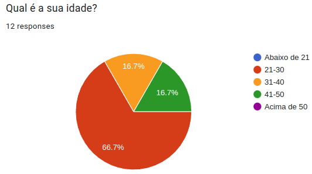

*Fonte: Autor*

É possível analisar na figura 1 que a maioria dos respondentes (66,7%) pertenciam entre a faixa de idade de 21 a 30 anos, 16,7% na faixa de 31 a 40 anos e 16,7% na faixa de 41 a 50 anos.

### Questão 2

*Figura 2: Questão "Qual é o seu gênero?"*

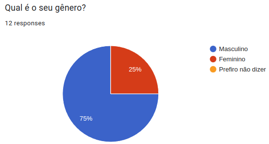

*Fonte: Autor*

A figura 2 indica que 75% dos respondentes eram do sexo masculino e 25% eram do sexo feminino, importante salientar que havia a opção de "Prefiro não dizer", para preservar a integridade dos respondentes.

### Questão 3

*Figura 3: Questão "Qual é a sua renda mensal bruta?"*

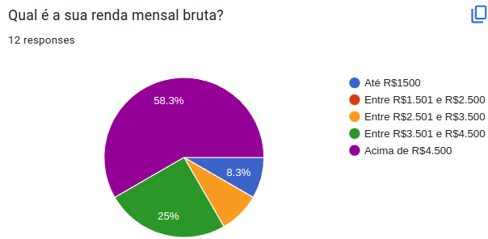

*Fonte: Autor*

A figura 3 mostra que a 58,3% dos participantes tinham renda mensal bruta de acima de R$4,500, 25% entre R$3,501 e R$4,500, 8,3% até R$1,500 e 8,4% entre R$2,501 e R$3,500.
### Questão 4

*Figura 4: Questão "Qual é o seu nível de escolaridade?"*

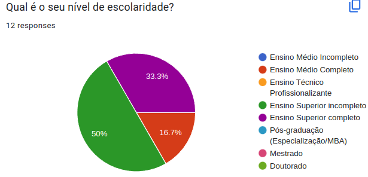

*Fonte: Autor*

A figura 4 aponta que 50% dos respondentes tinham o ensino superior incompleto, 33,3% tinham o ensino superior completo e 16,7% apenas o ensino médio completo.

### Questão 5

*Figura 5: Questão "Qual é a sua profissão?"*

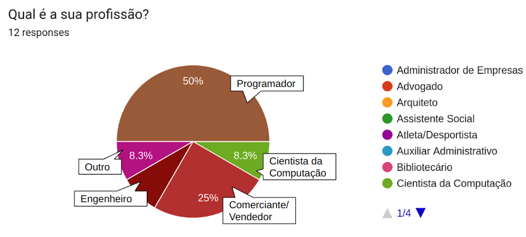

*Fonte: Autor*

A figura 5 indica que 50% dos respondentes eram programadores, isso se deve ao método de distribuição utilizado, 25% eram comerciantes/vendedores, 8,3% cientistas da computação, 8,3% Outro e 8,4% engenheiros.

### Questão 6

*Figura 6: Questão "Qual é o tamanho da empresa em que você trabalha?"*

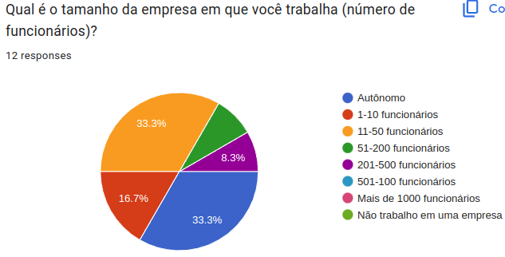

*Fonte: Autor*

Na figura 6 é visto que 33,3% dos respondentes trabalham em uma empresa com 11 a 50 funcionários, outros 33,3% são autônomos, 16,7% em uma empresa de 1 a 10 funcionários, 8,3% em uma empresa com 201 a 500 funcionários e 8,3% em uma empresa com 51 a 200 funcionários.

### Questão 7

*Figura 7: Questão "Com que frequência você utiliza o ISSNet?"*

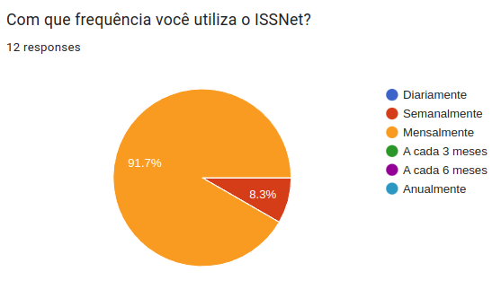

*Fonte: Autor*

A figura 7 evidencia que a grande parte dos usuários (91,7%) usam o sistema mensalmente e apenas 8,3% usam semanalmente.

### Questão 8

*Figura 8: Questão "Quais são as funcionalidades que você mais utiliza no ISSNet?"*

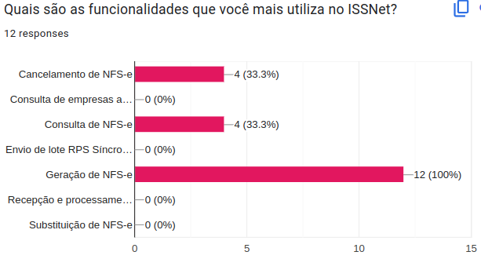

*Fonte: Autor*

Na figura 8 é possível ver que a atividade praticada por todos os usuários (100%) é a geração de NFS-e, 33,3% usam a consulta de NFS-e e/ou cancelamento de NFS-e.

### Questão 9

*Figura 9: Questão "Em que áreas do ISSNet você acredita que precisam de melhorias?"*

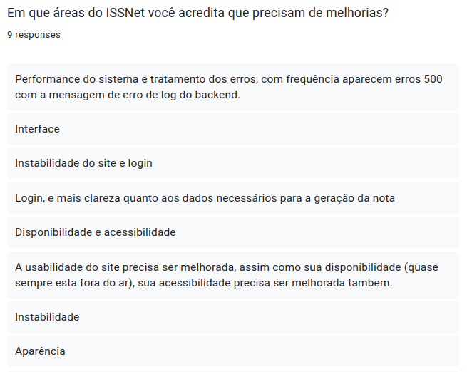

*Fonte: Autor*

Na questão aberta mostrada na figura 9, destaca-se 3 principais pontos que usuários acreditam que precise de melhorias:

- Interface de usuário;
- Performance do sistema;
- Acessibilidade.

### Questão 10

*Figura 10: Questão "Avalie de (1 a 5) a facilidade de uso do ISSNet"*

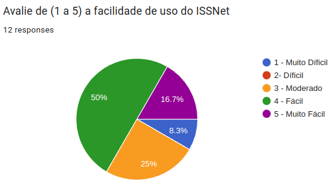

*Fonte: Autor*

Na avaliação da facilidade de uso apresentado na figura 10, 50% acham o sistema fácil de usar, 25% acham moderado, 16,7% acham muito fácil e 8,3% muito difícil.

### Questão 11

*Figura 11: Questão "Avalie de (1 a 5) o seu nível de satisfação com o ISSNet"*

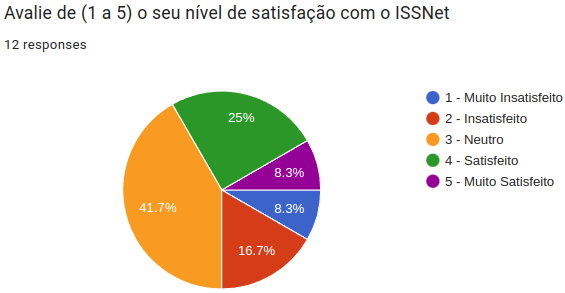

*Fonte: Autor*

A avaliação do nível de satisfação exibido na figura 11, evidencia que 41,7% dos respondentes estão neutros quanto a satisfação, 25% estão satisfeitos, 16,7% estão insatisfeitos, 8,3% estão muito satisfeitos e outros 8,3% estão muito insatisfeitos.

### Questão 12

*Figura 12: Questão "Você tem alguma sugestão para melhorar o ISSNet?"*

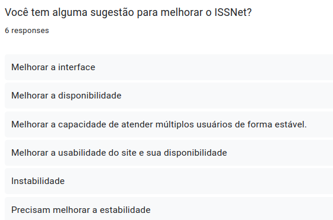

*Fonte: Autor*

Na questão aberta 12, foi reforçado os principais pontos apresentados na questão aberta 9, uma resposta evidencia o problema mais relatado: "Melhorar a capacidade de atender múltiplos usuários de forma estável." 

## Análise

Os respondentes programadores eram em sua maioria autônomos e comerciantes trabalhavam em empresas com mais de 11 funcionários, a grande maioria usa mensalmente para realizar duas funções principais: geração de NFS-e e consulta de NFS-e. Acham o sistema fácil de usar, mas não estão satisfeitos, reclamam principalmente da instabilidade do site e sua incapacidade de atender muitos usuários ao mesmo tempo, além da interface sem acessibilidade e com aparência datada.

| Características | Perfil |
| :---:           | :---:  |
|Idade | 21-30 |
|Sexo|Predominante masculino, 25% mulheres|
|Renda Mensal|Predominante acima de R$4.500|
|Profissão|Programador/Comerciante|
|Escolaridade| Superior Completo/ Superior Incompleto|
|Tamanho da Empresa| Autônomo/11-50 funcionários|
|Frequência de uso| Mensalmente|
|Tarefas principais|Geração de NFS-e, Consulta de NFS-e|
|Facilidade de uso (1 muito difícil, 5 muito fácil)|4 - Fácil|
|Satisfação de uso (1 muito insatisfeito, 5 muito satisfeito)|3 - Neutro|

A montagem do perfil de usuário é importante para entender bem as características dos usuários primários do sistema, reconhecer seus requisitos e também serve como base para a criação de [personas](./personas.md), personagens fictícios para representar os diferentes grupos alvo do sistema.
## Referências
[1]: SIMONE DINIZ JUNQUEIRO BARBOSA, BRUNO SANTANA DA SILVA, Interação Humano-Computador, 1a.
Edição, Editora Campus, 2010. Publicado em: 03/05/2021.

<!-- ## Bibliografia -->
<!-- FONTES CONSULTADAS DURANTE A ELABORAÇÃO DO TEXTO, CITADAS OU NÃO -->

## Histórico de revisão

| Versão     | Data        | Descrição            | Autor(es)                          | Revisores  |
| :--------: | :---------: | -------------------- | ---------------------------------- | ---------- |
| `0.0`      |  06/05/2023 | Criação do arquivo   | Arthur Trindade                | Miguel Moreira |
| `0.1`      |  07/05/2023 | Adiciona introdução  | Júlio César                    | Miguel Moreira |
| `0.2`      |  08/05/2023 | Adiciona outras seções | Júlio César, Marcus Vinicius | Miguel Moreira |
| `0.3`      |  08/05/2023 | Pequenas correções | Júlio César, Marcus Vinicius | Miguel Moreira |
| `0.4`      |  13/05/2023 | Correções | Júlio César | Miguel Moreira, Marcus Vinicius, Arthur Trindade |