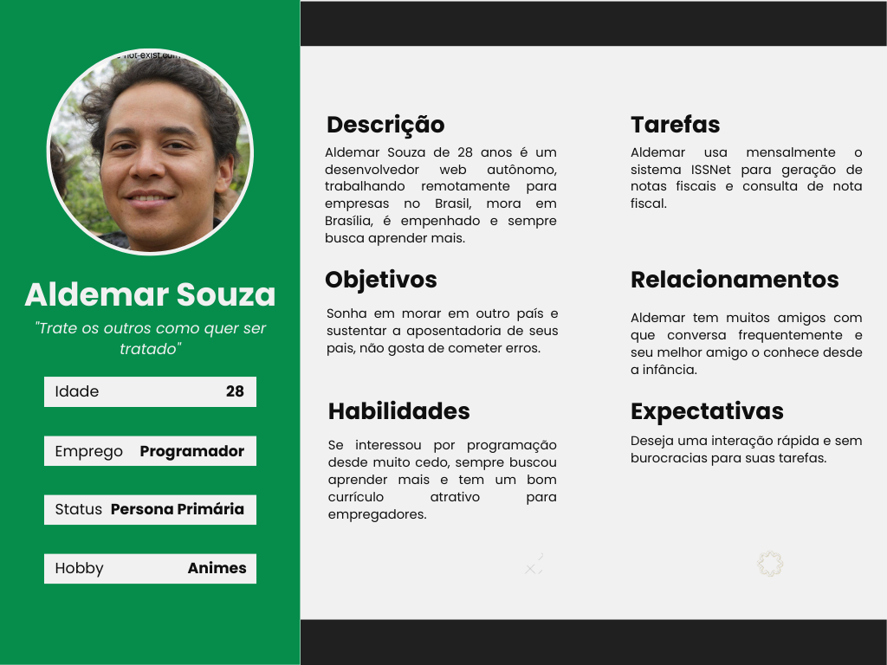
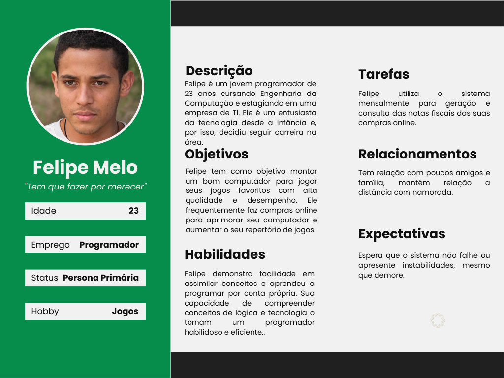
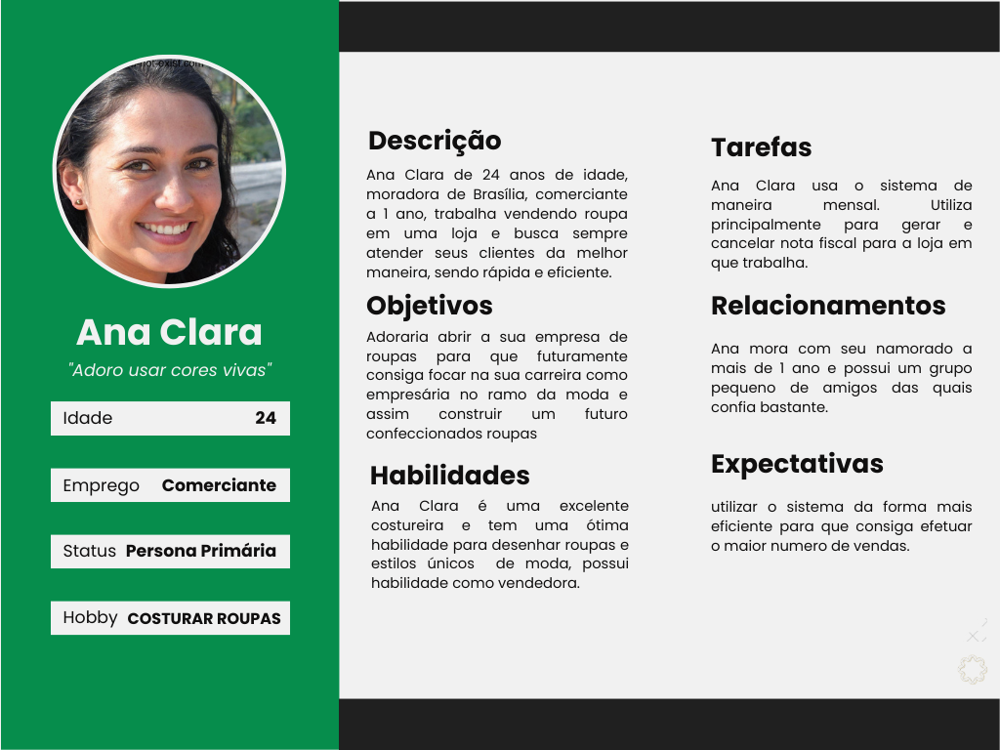
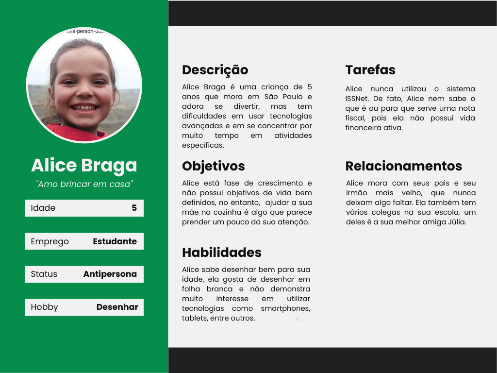

# Definição de personas
## Introdução
Personas são criações de personagens fictícios que representam um público alvo do produto, segundo Courage e Baxter (2005), tem características como: identidade, status, objetivos, habilidades, tarefas, relacionamentos, requisitos e expectativas<a href="#simone">[1]</a>. 
As personas são importantes na fase de design de um projeto pois ajudam a equipe a entender quem são os usuários e quais são as suas necessidades, desejos e expectativas em relação ao produto. Ao criar personas bem definidas, é possível visualizar e compreender melhor o público-alvo, facilitando a tomada de decisões de design e garantindo que o produto atenda às necessidades dos usuários.

As personas são divididas em três categorias: primárias, secundárias e antipersonas. As personas primárias são as que representam o público-alvo principal, enquanto as personas secundárias representam usuários secundários que podem se beneficiar do produto. As antipersonas, por outro lado, representam usuários que não são adequados para o produto ou que podem prejudicar sua experiência de uso. A criação de todas as três categorias de personas pode ajudar a equipe de design a identificar os diferentes tipos de usuários e criar soluções de design para atender a cada um deles.

## Elenco de personas
Partindo dos dados obtidos na pesquisa realizada e na elaboração do [perfil do usuário](./perfil_de_usuario.md), foi possível coletar dados que expressam as principais características do publico alvo e as suas necessidades. Com base nesses dados, a equipe criou um elenco de personas que representam os diferentes tipos de usuários e suas respectivas características.

Segundo Simone (2010), é ideal que um elenco de personas possua entre 3 e 12 personas, por isso, a equipe decidiu por um elenco composto por 3 personas e 1 antipersona:

### Aldemar Souza

*Figura 1: Persona 1*

*Fonte: Autor*

### Felipe Melo

*Figura 1: Persona 2*

*Fonte: Autor*

### Ana Clara

*Figura 1: Persona 3*

*Fonte: Autor*

### Alice Braga

*Figura 1: Antipersona*

*Fonte: Autor*

## Referências
[1]: SIMONE DINIZ JUNQUEIRO BARBOSA, BRUNO SANTANA DA SILVA, Interação Humano-Computador, 1a.
Edição, Editora Campus, 2010. Publicado em: 03/05/2021.

## Bibliografia
Personas, Lichess. Disponível em:  <https://interacao-humano-computador.github.io/2022.2-Lichess/analise_requisitos/aspectos_eticos/>

Personas, CIEE. Disponível em:  <https://interacao-humano-computador.github.io/2022.1-CIEE/analise_requisitos/aspectos_eticos/>

## Histórico de revisão

| Versão     | Data        | Descrição            | Autor(es)                          | Revisores  |
| :--------: | :---------: | -------------------- | ---------------------------------- | ---------- |
| `0.0`      |  06/05/2023 | Criação do arquivo   | Arthur Trindade                | Miguel Moreira |
| `0.1`      |  07/05/2023 | Adiciona introdução  | Júlio César                    | Miguel Moreira |
| `0.2`      |  08/05/2023 | Adição do elenco de persona  | Arthur Trindade Júlio César Marcus Vinicus | Miguel Moreira |