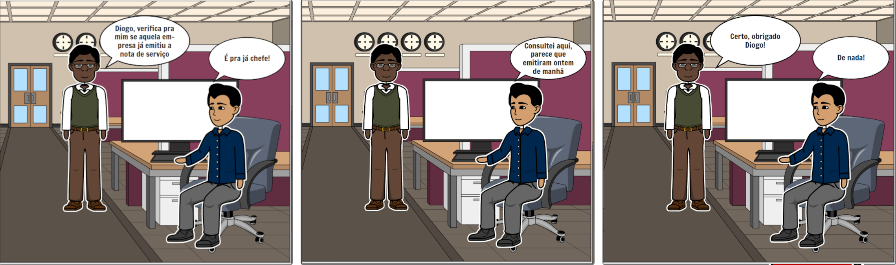
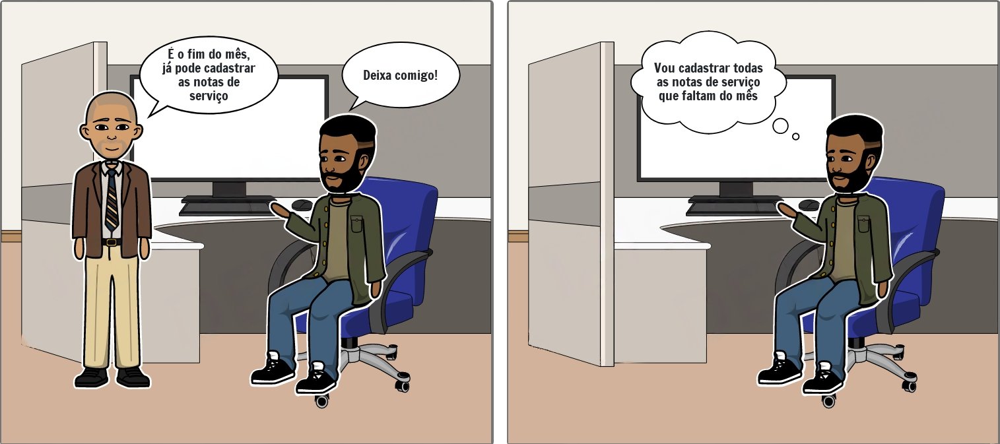

# Planejamento da Avaliação de Storyboard

## Introdução
Este artefato descreve os principais elementos do planejamento da avaliação dos storyboards utilizados para visualização das tarefas apresentadas na [análise de tarefas](https://interacao-humano-computador.github.io/2023.1-ISSNet/analise_de_requisitos/analise_de_tarefas/) do sistema. 

Nesse contexto, a avaliação dos storyboards seguirá o framework DECIDE proposto por Sharp, Rogers e Preece em 2007. Esse framework estabelece os elementos essenciais para uma avaliação efetiva de Interação Humano-Computador (IHC):

- Determinar os [**objetivos da avaliação**](#objetivos-da-avaliação) de IHC, identificando sua importância e para quem são relevantes. Isso proporcionará uma direção clara para a avaliação do protótipo de alta fidelidade.
- [**Explorar as perguntas**](#explorar-as-perguntas) a serem respondidas durante a avaliação, considerando o perfil dos usuários e suas atividades. Isso garantirá que a avaliação aborde os aspectos cruciais para a usabilidade e experiência do usuário.
- Escolher os [**métodos de avaliação**](#métodos-de-avaliação) a serem utilizados, levando em conta os objetivos esperados, prazos, orçamento, equipamentos e a expertise dos avaliadores. A escolha adequada dos métodos garantirá resultados confiáveis e relevantes.
- Identificar [**questões práticas**](#questões-práticas) da avaliação, como recrutamento de usuários, preparação e uso de equipamentos, prazos, orçamentos e recursos necessários. Essa etapa assegurará a execução eficiente da avaliação do protótipo de alta fidelidade.
- Decidir como lidar com [**questões éticas**](#questões-éticas), garantindo o respeito aos participantes e evitando qualquer forma de prejuízo durante e após a avaliação. A ética é fundamental para uma avaliação responsável e confiável.
- [**Avaliar, interpretar e apresentar os resultados**](#avaliar-interpretar-e-apresentar-os-resultados), considerando a confiabilidade dos dados, a validade interna, a validade externa e a validade ecológica. Essa análise aprofundada dos resultados fornecerá insights valiosos para aprimorar o protótipo e a experiência do usuário.

Seguindo o framework DECIDE, a avaliação dos storyboards garantirá uma abordagem sistemática e abrangente, resultando em melhorias significativas no design e na usabilidade do produto final.

## Objetivos da avaliação
Os principais objetivos da avaliação dos storyboards é avaliar se as tarefas representadas condizem com a realidade do usuário e coletar feedback dos usuários a respeito das tarefas. Esse planejamento é importante pois permite identificar problemas precocemente e coletar dados para futuras tomada de decisões.

## Explorar as perguntas
A seguir, apresentamos o roteiro de perguntas que será utilizado durante a avaliação, que deve ser executado para cada um dos storyboards desenvolvidos.

<ol>
    <li> As tarefas representadas no storyboard são condizentes com a realidade?
        <ul>
            <li> Sim
            <li> Não
            <li> Não tenho certeza
        </ul>
    </li>
    <li> A sequência de ações do storyboard é condizente com a realidade?
        <ul>
            <li> Sim
            <li> Não
            <li> Não tenho certeza
        </ul>
    </li>
        <li> Existe alguma situação que você considera ruim e que não está ilustrada no storyboard? Se sim, qual(is)?
        <ul>
            <li> Sim (aberta)
            <li> Não
        </ul>
    </li>
    <li> Em uma escala de 1 a 5, qual o seu grau de satisfação com a execução da tarefa ilustrada no storyboard?
        <ul>
            <li> 1: Insatisfeito
            <li> 2: Pouco satisfeito
            <li> 3: Indiferente
            <li> 4: Satisfeito
            <li> 5: Muito satisfeito
        </ul>
    </li>
        <li> Sobre o storyboard, você possui alguma sugestão de melhoria que poderia ser implementada na tarefa ilustrada? Se sim, qual(is)?
        <ul>
            <li> Sim (aberta)
            <li> Não
        </ul>
    </li>
</ol>

## Métodos de avaliação
A avaliação do planejamento dos storyboards será conduzida por meio de entrevistas, que podem ocorrer presencialmente ou de forma online utilizando a plataforma Teams, e questionários online, para atingir um maior número de usuários. 

Levando em consideração as questões éticas, no início da entrevista será apresentado o [termo de consentimento](../../../analise_de_requisitos/aspectos_eticos.md#termo-de-consentimento) ao entrevistado, permitindo que ele decida se deseja ou não participar. Caso o entrevistado concorde, o entrevistador seguirá o [roteiro](#roteiro-de-perguntas) estabelecido neste artefato para realizar as perguntas. Para o caso do questionário, o termo será apresentado antes das perguntas, caso o participante concorde com os termos, ele poderá prosseguir para as perguntas. 

A partir dos dados obtidos durante a entrevista e a partir do questionário, a equipe poderá analisar os pontos fortes e áreas de melhoria do site, possibilitando uma refatoração eficiente e alinhada aos requisitos dos usuários.

## Questões Práticas

### Participantes
Os usuários que participarão da avaliação serão contatados por meio de mensagens via WhatsApp ou Telegram. A seleção desses usuários foi realizada com base em seu interesse e disponibilidade para participar da entrevista. 

Está prevista a participação de, no mínimo, três usuários na avaliação por meio de entrevistas. Essa quantidade foi determinada devido ao número limitado de participantes que manifestaram interesse e disponibilidade para o estudo. No entanto, para mitigar esse problema, os questionários também serão utilizados como parte do processo de coleta de dados.

### Equipamentos necessários
A avaliação por meio de entrevistas poderá ocorrer tanto de forma presencial quanto remota, levando em consideração as circunstâncias e preferências dos participantes. No caso das entrevistas presenciais, a voz dos entrevistados será gravada em dispositivo móvel em conformidade com os [termos de consentimento](../../../analise_de_requisitos/aspectos_eticos.md#termo-de-consentimento) estabelecidos para fins de avaliação. Se a entrevista for realizada de forma remota, a equipe utilizará a plataforma Teams para gravar a reunião.

### Teste Piloto
Antes de iniciar as entrevistas, é recomendado que os entrevistadores realizem um teste piloto para avaliar a viabilidade do processo e identificar possíveis problemas, falhas ou limitações. Durante o teste piloto, os seguintes aspectos devem ser verificados:

- **Conexão com a internet**: É importante garantir uma conexão estável e confiável para facilitar a comunicação durante as entrevistas.
- **Áudio do microfone**: Verificar se o áudio do microfone está funcionando corretamente para garantir uma comunicação clara e sem problemas.
- **Compartilhamento de tela**: Testar a capacidade de compartilhar a tela, caso seja necessário apresentar algo durante as entrevistas.
- **Ferramenta de gravação de vídeo**: Verificar se a ferramenta de gravação de vídeo está configurada e funcionando adequadamente, caso seja necessário gravar as entrevistas para referência futura.
- **Editor de texto ou papel para anotar resultados**: Assegurar que haja uma forma adequada de registrar os resultados das entrevistas, seja por meio de um editor de texto digital ou por anotações em papel.

Realizar um teste piloto abrangente antes das entrevistas proporcionará maior confiança no processo, permitindo ajustes necessários e garantindo que as entrevistas sejam conduzidas de forma eficiente.

### Cronograma planejado e prazos
A expectativa é que as entrevistas para a avaliação sejam realizadas no sábado, dia 27/05, levando em conta o tempo necessário para a preparação, agendamento e realização das entrevistas. Essas considerações práticas foram feitas para garantir a viabilidade e o bom andamento da avaliação, visando obter insights relevantes sobre a usabilidade do site IssNetDF. A seguir, apresentamos o cronograma planejado para as entrevistas:

| Storyboard avaliado                                                                                                  | Local                      | Data de realização | Horário | Entrevistador    | Entrevistado |
| -------------------------------------------------------------------------------------------------------------------- | -------------------------- | ------------------ | ------- | ---------------- | --- |
| Teste Piloto                                                                                                         | Plataforma Microsoft Teams | 27/05/2023         | 18:45   | Arthur Trindade Gabriel de Souza  | - |
| [Consulta de nota fiscal de serviço](../../nivel1/storyboard/plan_avaliacao_storyboard.md#storyboards-desenvolvidos) | Plataforma Microsoft Teams | 27/05/2023         | 19:00   | Arthur Trindade  | - |
| [Emissão de nota fiscal eletrônica](../../nivel1/storyboard/plan_avaliacao_storyboard.md#storyboards-desenvolvidos)  | Plataforma Microsoft Teams | 27/05/2023         | 19:30   | Miguel Moreira   | - |
| [Cancelamento de nota fiscal](../../nivel1/storyboard/plan_avaliacao_storyboard.md#storyboards-desenvolvidos)        | Plataforma Microsoft Teams | 27/05/2023         | 20:00   | Gabriel de Souza | - |

*Tabela 1: Cronograma planejado de avaliação dos storyboards*

## Questões Éticas
Para realizar a entrevista, é necessário que o entrevistador informe ao entrevistado o [termo de consentimento](../../../analise_de_requisitos/aspectos_eticos.md#termo-de-consentimento) e obtenha sua concordância com os termos estabelecidos. É fundamental ressaltar que a equipe valoriza e assegura a máxima proteção, respeito e confidencialidade dos dados coletados dos entrevistados.

## Avaliar, interpretar e apresentar os resultados
A interpretação dos dados será realizada após as entrevistas, e os dados obtidos serão apresentados de acordo com o [planejamento do relato dos reultados](relato_storyboard.md).

## Storyboards desenvolvidos
Os storyboards foram desenvolvidos usando as [análises de tarefa](https://interacao-humano-computador.github.io/2023.1-ISSNet/analise_de_requisitos/analise_de_tarefas/) e [cenários](https://interacao-humano-computador.github.io/2023.1-ISSNet/analise_de_requisitos/cenarios/) desenvolvidos para tarefas de geração, cancelamento e consulta de NFS-e, foi usado a ferramenta [StoryboardThat](../../../planejamento/ferramentas/#storyboardthat)

Na Figura 1 é apresentado o storyboard de consulta de NFS-e, um chefe de um funcionário pede para ele que consulte a nota fiscal de uma empresa que prestou serviços a eles.

*Figura 1: Storyboard Consulta NFS-e* 

*Fonte: Autor* 

Na figura 2 é mostrado o storyboard de geração de NFS-e, no fim do mês, um chefe pede ao funcionário para que ele cadastre todas as notas de serviço do mês.

*Figura 2: Storyboard Geração NFS-e* 

*Fonte: Autor* 

No storyboard da figura 3, um cliente pede reembolso por motivo de serviço não prestado, em seguida a funcionária devolve o dinheiro e cancela a nota fiscal de serviço.

*Figura 3: Storyboard Cancelamento NFS-e* 

*Fonte: Autor* 

## Bibliografia
<!-- FONTES CONSULTADAS DURANTE A ELABORAÇÃO DO TEXTO, CITADAS OU NÃO. REMOVER CASO NÃO HOUVER -->
SIMONE DINIZ JUNQUEIRO BARBOSA, BRUNO SANTANA DA SILVA, Interação Humano-Computador, 1a.
Edição, Editora Campus, 2010. Publicado em: 03/05/2021.

Planejamento da Avaliação do Storyboard, Lichess. Disponível em: <https://interacao-humano-computador.github.io/2022.2-Lichess/design_avaliacao_desenvolvimento/nivel_1/storyboard/planejamento_avaliacao/>

Planejamento da Avaliação do Storyboard, Millenium Papelaria. Disponível em: <https://interacao-humano-computador.github.io/2022.1-Millenium-Papelaria/DesignAvaliacaoDesenvolvimento/nivel1/planejamentoAvaliacaoStoryBoard/>

## Histórico de revisão

| Versão     | Data        | Descrição                                  | Autor(es)       | Revisores       |
| :--------: | :---------: | ------------------------------------------ | --------------- | --------------- |
| `0.0`      |  20/05/2023 | Criação do arquivo                         | Júlio César     | - |
| `0.1`      |  22/05/2023 | Planejamento da avaliação dos storyboards  | Arthur Trindade | Miguel Moreira |
| `0.2`      |  28/05/2023 | Adiciona storyboards desenvolvidos na sala | Júlio César Arthur Trindade Arthur Assumpção Miguel Moreira Gabriel de Souza Marcus Vinicius | Miguel Moreira |
| `0.3`      |  28/05/2023 | Padronização do documento e ajustes        | Arthur Trindade | Julio César |
| `0.4`      |  04/06/2023 | Padronização do documento e ajustes        | Arthur Trindade | Julio César |
| `0.5`      |  02/07/2023 | Padronização dos títulos do documento e ajustes  | Arthur Trindade | Julio César |

