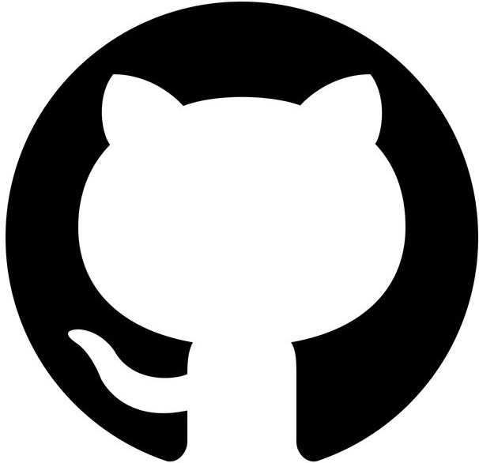
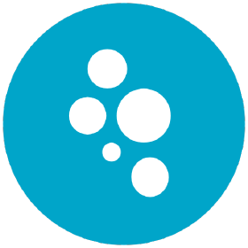
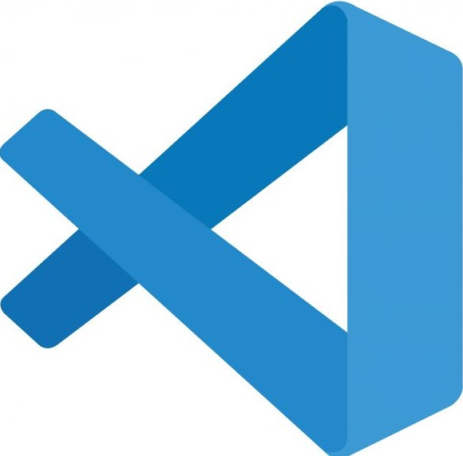

# <b> Ferramentas Utilizadas no Projeto</b>

## 1. Introdução
Neste documento se encontra a lista de ferramentas que usaremos para o desenvolvimento do projeto, seja para criação de artefatos ou auxílio nas tarefas. Novas ferramentas podem ser inseridas se houver necessidade. Todas são gratuitas e de fácil acesso.

## 2. Ferramentas
|                          Ferramenta                                        |    Nome    |                                                Utilidade                                                                                                                                      |
| :-----------------------------------------:                                | :--------: | :--------------------------------------------------------------------------------------------------------------------------------------------------------------------------------------:|
|             |   GitHub   |         O GitHub é ambiente de desenvolvimento de software baseada na nuvem. Utilizado pela nosse equipe para hospedar os repositorios, alem de utilizar outras ferramentas da mesma plataforma, como GitPages, GitProjects. [^1]| 
|           |   Discord  |         O Discord é uma plataforma de comunicação on-line baseada em chat e voz. Utilziada pelo nosso grupo para comunicação e onde foram feitas as primeiras gravações e reuniões.| 
|          |Microsoft Teams|      O Microsoft Teams é uma plataforma de comunicação projetada para equipes de trabalho realizarem suas reuniões. Atualmente esta será a plataforma utilizada pelo grupo para as reuniões futuras.>| 
|                   | OBS Studio |         O OBS é uma programa de streaming muito utilizado para realizar gravações. Nosso grupo faz o uso do programa para gravar as reuniões.>| 
|               |    Figma   |         Figma é uma ferramenta de design de interfaces muito utilizado para realizar prototipagens. Realizaremos o uso desta ferramenta para criar telas e gerar prototipos.>| 
|             |    MkDocs  |         O MkDocs é uma ferramenta que permite criar uma documentação de sites estaticos a partir de arquivos markdown.>[7] |
|                   |  WhatsApp  |         O WhatsApp é uma ferramenta de comunicação como o telegram. Outra ferramenta utilizada pelo grupo para comunicação e gereciamento de atividades.>| 
|         |  Usabilla  |         Usabilla é uma ferramenta que permite o gerenciamento e criação de avaliações heuristicas de maneira personalizavel. Será uma ferramenta futura utilizada pelo grupo para criar tarefas e gerar formularios/testes da nossa escolha.| 
|           |   Youtube  |         YouTube é uma plataforma de compartilhamento de vídeo online, onde os usuários podem carregar, compartilhar e visualizar vídeos. Utilizamos a plataforma para inserir as reuniões feitas pelo grupo.|
|       |   VSCode  |          O vscode é um editor de texto com uma variedade de extensões para desenvolvimento de softwares. Será utilizado pelo grupo para editar os arquivos markdown.|

Fonte: Grupo UnbIdiomas-2022.2, acessado em: 25 de abril de 2023. Disponivel em: <https://github.com/Interacao-Humano-Computador/2022.2-UnbIdiomas>

## 3. Referencias
[^1]: GITHUB. 2023. Disponivel em: <https://github.com>. Acesso em 25/04/2023.

[^2] DISCORD. 2023. Disponivel em:  <https://discord.com>. Acesso em 25/04/2023.

[^3] MSTEAMS. 2023. Disponivel em: <https://www.microsoft.com/pt-br/microsoft-teams/log-in>. Acesso em 25/04/2023.

[^4] TELEGRAM. 2023. Disponivel em: <https://web.telegram.org/z/>. Acesso em 25/04/2023.

[^5] OBS. 2023. Disponivel em: <https://obsproject.com/pt-br/download>. Acesso em 25/04/2023.

[^6] FIGMA. 2023. Disponivel em: <https://www.figma.com>. Acesso em 25/04/2023.

[^7] MKDOCS. 2023. Disponivel em: <https://www.mkdocs.org>. Acesso em 25/04/2023.

[^8] WPP. 2023. Disponivel em: <https://web.whatsapp.com>. Acesso em 25/04/2023.

[^9] USABILLA. 2023. Disponivel em: <https://www.getfeedback.com/resources/cx/usabilla/>. Acesso em 25/04/2023.

[^10] YOUTUBE. 2023. Disponivel em: <https://www.youtube.com>. Acesso em 25/04/2023.

## Histórico de revisão

| Versão     | Data        | Descrição                                            | Auto(es)                                    | Revisores        |
| :--------: | :---------: | ---------------------------------------------------- | ------------------------------------------- | ---------------- |
| `0.0`      |  22/04/2023 | Criação do arquivo                                   | Arthur Carneiro Trindade                    | -                |
| `0.1`      |  25/04/2023 | Desenvolvimento do arquivo                           | Marcus Vinicius Cunha Dantas                | Júlio César Costa|
