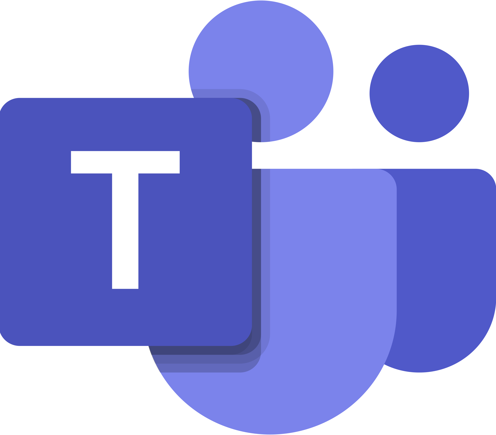
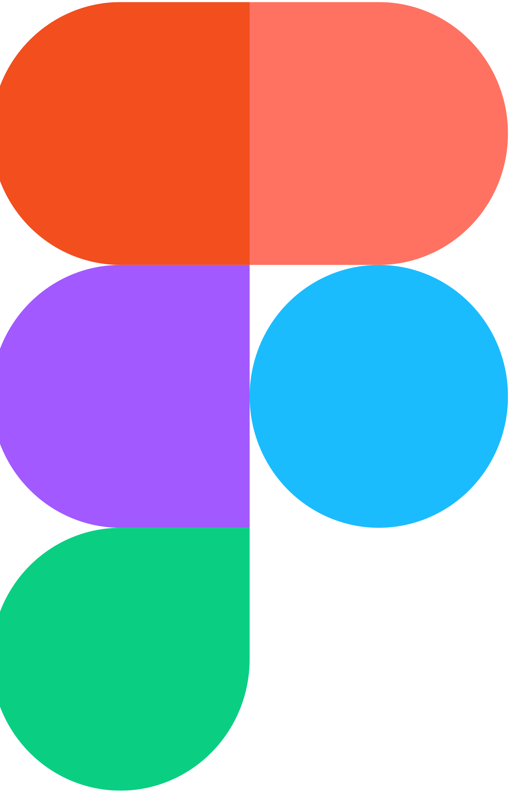

# **Ferramentas Utilizadas no Projeto**

## Introdução

Nesta parte do documento será descrito a lista de ferramentas que usaremos no decorrer do desenvolvimento do projeto, seja para criação de artefatos ou auxílio nas tarefas. Novas ferramentas podem surgir com a necessidade alem de todas serem gratuitas.

## Ferramentas

|                          Ferramenta                                           |    Nome    |                                                Utilidade                                                                                                                                      |
| :-----------------------------------------:                                   | :--------: | :--------------------------------------------------------------------------------------------------------------------------------------------------------------------------------------:|
|                                         |   GitHub   |         O GitHub é ambiente de desenvolvimento de software baseada na nuvem. Utilizado pela nossa equipe para hospedar os repositórios, além de utilizar outras ferramentas da mesma plataforma, como GitPages, GitProjects. <a href="#github">[1]</a>| 
|                                       |   Discord  |         Discord é uma plataforma de comunicação on-line baseada em chat e voz. Utilizada pelo nosso grupo para comunicação e onde foram feitas as primeiras gravações e reuniões.<a href="#discord">[2]</a>| 
|                                       |Microsoft Teams|      O Microsoft Teams é uma plataforma de comunicação projetada para equipes de trabalho realizarem suas reuniões. Atualmente esta será a plataforma utilizada pelo grupo para as reuniões futuras.<a href="#msteams">[3]</a>| 
|                                               | OBS Studio |         O OBS é uma programa de streaming muito utilizado para realizar gravações. Nosso grupo faz o uso do programa para gravar as reuniões. <a href="#obs">[4]</a>| 
|                                           |    Figma   |         Figma é uma ferramenta de design de interfaces muito utilizado para realizar prototipagens. Realizaremos o uso desta ferramenta para criar telas e gerar protótipos.<a href="#figma">[5]</a>| 
|                                         |    MkDocs  |         MkDocs é uma ferramenta que permite criar uma documentação de sites estáticos a partir de arquivos markdown. <a href="#mkdocs">[6]</a> |
|                                          |  WhatsApp  |         O WhatsApp é uma ferramenta de comunicação como o telegram. Outra ferramenta utilizada pelo grupo para comunicação e gerenciamento de atividades. <a href="#wpp">[7]</a>| 
|      |  this person does not exist  |     Esta ferramenta foi utilizada pelo grupo para gerar pessoas fictícias da quais comporam nosso elenco de personas, este site tem o intuito de gerar fotos de pessoas fictícias.<a href="#logo_tpde">[8]</a>| 
|                                       |   Youtube  |         YouTube é uma plataforma de compartilhamento de vídeo online, onde os usuários podem carregar, compartilhar e visualizar vídeos. Utilizamos a plataforma para inserir as reuniões feitas pelo grupo.<a href="#youtube">[9]</a>|
|                                   |   VSCode   |         O vscode é um editor de texto com uma variedade de extensões para desenvolvimento de softwares. Será utilizado pelo grupo para editar os arquivos markdown.<a href="#vscode">[10]</a>|
|                                           |   Canva    |         Canva é uma plataforma de design da qual permite que os seus usuários criem diversos tipos de conteúdos e disponibilizem ou de forma gratuita ou paga para outras pessoas. Será utilizado pelo grupo para realizar algumas tarefas necessárias como a criação de personas. <a href="#canva">[11]</a>
|                                   | Google Forms | Google Forms é um aplicativo de gerenciamento de pesquisa. Está sendo utilizado para gerar os formulários que serão preenchidos pelos usuários. <a href="#gforms">[12]</a>|
|                                   | StoryboardThat | Uma ferramenta usada no projeto para criação de storyboards, possui cenários, atores, balões de conversa e desenhos<a href="#storyboardthat">[13]</a>|

Fonte: Grupo UnbIdiomas-2022.2, acessado em: 25 de abril de 2023. Disponivel em: <https://github.com/Interacao-Humano-Computador/2022.2-UnbIdiomas>

## Referências

[1]: GITHUB. 2023. Disponivel em: <https://github.com>. Acesso em 25/04/2023.

[2]: DISCORD. 2023. Disponivel em:  <https://discord.com>. Acesso em 25/04/2023.

[3]: MSTEAMS. 2023. Disponivel em: <https://www.microsoft.com/pt-br/microsoft-teams/log-in>. Acesso em 25/04/2023.

[4]: OBS. 2023. Disponivel em: <https://obsproject.com/pt-br/download>. Acesso em 25/04/2023.

[5]: FIGMA. 2023. Disponivel em: <https://www.figma.com>. Acesso em 25/04/2023.

[6]: MKDOCS. 2023. Disponivel em: <https://www.mkdocs.org>. Acesso em 25/04/2023.

[7]: WPP. 2023. Disponivel em: <https://web.whatsapp.com>. Acesso em 25/04/2023.

[8]: this person does not exist. 2023. Disponivel em: <https://this-person-does-not-exist.com/en>. Acesso em 25/04/2023.

[9]: YOUTUBE. 2023. Disponivel em: <https://www.youtube.com>. Acesso em 25/04/2023.

[10]: VSCode. 2023. Disponivel em: <https://code.visualstudio.com>. Acesso em 25/04/2023.

[11]: CANVA. 2023. Disponivel em: <https://www.canva.com/>. Acesso em 08/05/2023.

[12]: GOOGLE FORMS. 2023. Disponivel em: <https://docs.google.com/forms/>. Acesso em 08/05/2023.

[13]: STORYBOARDTHAT. 2023. Disponivel em: <https://www.storyboardthat.com/>. Acesso em 28/05/2023.

## Histórico de revisão

| Versão     | Data        | Descrição                                            | Autor(es)                                    | Revisores       |
| :--------: | :---------: | ---------------------------------------------------- | ------------------------------------------- | ---------------- |
| `0.0`      |  22/04/2023 | Criação do arquivo                                   | Arthur Carneiro Trindade                    | -                |
| `0.1`      |  25/04/2023 | Desenvolvimento do arquivo                           | Marcus Vinicius Cunha Dantas                | Júlio César Costa|
| `0.2`      |  25/04/2023 | Correções de link no Arquivo                         | Marcus Vinicius Cunha Dantas                | Júlio César Costa|
| `0.3`      |  25/04/2023 | Correções de referencia no Arquivo                   | Marcus Vinicius Cunha Dantas                | Júlio César Costa|
| `0.4`      |  25/04/2023 | Correções de referencia no Arquivo                   | Marcus Vinicius Cunha Dantas                | Júlio César Costa|
| `0.5`      |  26/04/2023 | Correções de de imagens e referecias                 | Marcus Vinicius Cunha Dantas                | Júlio César Costa|
| `0.6`      |  08/05/2023 | Atualização de ferramenta                            | Marcus Vinicius Cunha Dantas                | Júlio César Costa|
| `0.7`      |  28/05/2023 | Adiciona StoryboardThat                              | Júlio César                                 | Arthur Trindade  |
| `0.8`      |  04/05/2023 | Adiciona this person does not exist                  | Marcus Vinicius Cunha Dantas                | Júlio César Costa|
| `0.8`      |  04/05/2023 | Correções de referencia no Arquivo                   | Marcus Vinicius Cunha Dantas                | Júlio César Costa|
