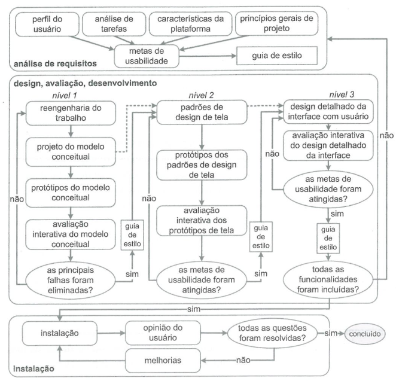

# Processo de Design

## Ciclo de Vida de Mayhew

*Figura 1: Ciclo de Vida de Mayhew adaptado por Simone, 2010*

Foi escolhido pelo grupo o ciclo de vida de Mayhew, o ciclo de Mayhew foi comparado com outras alternativas postas no livro da Simone, como o ciclo de vida em estrela e o simples, mas ambos não possuem atividades tão detalhadas quanto o ciclo de Mayhew, o detalhamento das atividades irá facilitar o processo de design com um caminho bem estabelecido para o projeto.

O ciclo criado por Deborah Mayhew (1999) é dividido entre análise de requisitos, onde os requisitos são estabelecidos, a fase de design, avaliação e desenvolvimento consiste em criar uma solução que atende os requisitos e a fase de instalação consiste na validação do usuário sobre o sistema.

## Bibliografia

[1] SIMONE DINIZ JUNQUEIRO BARBOSA, BRUNO SANTANA DA SILVA, Interação Humano-Computador, 1a.
Edição, Editora Campus, 2010. Publicado em: 03/05/2021.

## Histórico de revisão

| Versão     | Data        | Descrição            | Autor(es)                          | Revisores  |
| :--------: | :---------: | -------------------- | ---------------------------------- | ---------- |
| `0.0`      |  22/04/2023 | Criação do arquivo   | Arthur Carneiro Trindade           | -          |
| `0.1`      |  23/04/2023 | Versão Inicial       | Júlio César Costa                  | Marcus Vinicius Cunha |
| `0.2`      |  25/04/2023 | Adicionado revisores | Júlio César Costa                  | Marcus Vinicius Cunha |