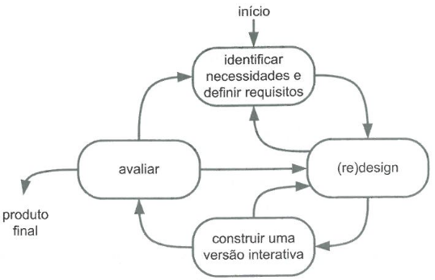
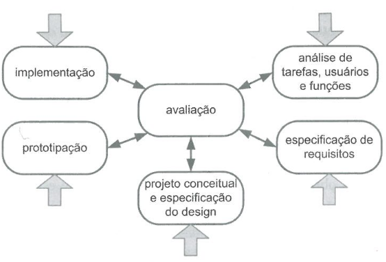
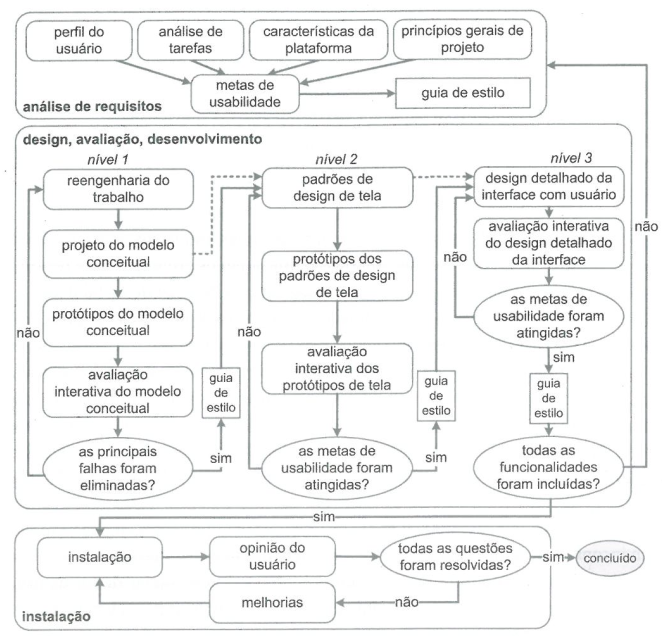

# Processo de Design

## Introdução

Processo de design é uma especificação de como produzir artefatos (frutos do trabalho humano) de forma eficiente e eficaz, e segundo Lawson em 2006, uma atividade de design compõe basicamente: análise da situação atual, síntese de uma intervenção (planejamento e execução) e avaliação da nova situação após a intervenção (Simone, 2010; p.92).

## Ciclo de Vida Simples

*Figura 1: Ciclo de vida simples*

*Fonte: adaptado de Sharp et al, por Simone, 2010*

O ciclo de vida simples na figura 1 apresenta quatro atividades, sendo elas a identificação dos requisitos, o design da solução, prototipação e avaliação do prototipação, é um modelo bastante abrangente, não sendo específico para a área de engenharia de usabilidade. (Simone, 2010; p.102).

## Ciclo de Vida em Estrela

*Figura 2: Ciclo de vida em estrela*

*Fonte: Simone, 2010*

Desenvolvido por Hix e Hartson em 1993, o ciclo de vida em estrela da figura 2, pode-se iniciar de qualquer uma das atividades, todas elas tem como o centro a avaliação para validar se está conforme os requisitos, a atividade de análise levanta informações da situação atual, a especificação de requisitos define os problemas a serem resolvidos, as atividades de síntese consistem de: projeto conceitual e especificação do design, prototipação, implementação. (Simone, 2010; p.103).

## Engenharia de Usabilidade de Nielsen

1. Conheça seu usuário
2. Realiza uma análise competitiva
3. Defina as metas de usabilidade
4. Faça designs paralelos
5. Adote o design participativo
6. Faça o design coordenado da interface como um todo
7. Aplique diretrizes e análise heurística
8. Faça protótipos
9. Realize testes empíricos
10. Pratique design iterativo

*Fonte: Adaptado de Jakob Nielsen por Simone, 2010*

A engenharia de usabilidade proposta por Jakob Nielsen em 1993 define um conjunto de atividades a serem seguidas durante o projeto, com identificação de usuários, análise do mercado, atividades de síntese, análises e testes. (Simone, 2010; p.104)

## Ciclo de Vida de Mayhew

*Figura 3: Ciclo de vida de Mayhew*

*Fonte: adaptado de Mayhew, por Simone, 2010*

O ciclo criado por Deborah Mayhew (1999) e mostrado na figura 3 é dividido entre análise de requisitos, onde os requisitos são estabelecidos, a fase de design, avaliação e desenvolvimento consiste em criar uma solução que atende os requisitos e a fase de instalação consiste na validação do usuário sobre o sistema. (Simone, 2010, p.110)

## Ciclo Escolhido pelo Grupo e Utilização

Foi escolhido pelo grupo o ciclo de vida de Mayhew, o **ciclo de Mayhew** foi comparado com outras alternativas postas no livro da Simone, como o ciclo de vida em estrela e o simples, mas todos não possuem atividades tão detalhadas quanto o ciclo de Mayhew, o detalhamento das atividades irá facilitar o processo de design com um caminho bem estabelecido para o projeto.

Com a utilização do ciclo de Mayhew, os artefatos [perfil de usuário](https://interacao-humano-computador.github.io/2023.1-ISSNet/analise_de_requisitos/perfil_de_usuario/), [análise de tarefas](https://interacao-humano-computador.github.io/2023.1-ISSNet/analise_de_requisitos/analise_de_tarefas/), [características da plataforma](https://interacao-humano-computador.github.io/2023.1-ISSNet/analise_de_requisitos/caracteristicas_da_plataforma/), [princípios gerais](https://interacao-humano-computador.github.io/2023.1-ISSNet/analise_de_requisitos/principios_gerais/) influenciam na criação das [metas de usabilidade](https://interacao-humano-computador.github.io/2023.1-ISSNet/analise_de_requisitos/metas_de_usabilidade/) que por sua vez é necessário para a criação da [guia de estilo](https://interacao-humano-computador.github.io/2023.1-ISSNet/analise_de_requisitos/guia_de_estilo/). O projeto trabalhará apenas no modelo conceitual, logo não avaliará em nenhum momento telas do sistema real ISSNet.

Segue explicação do que será feito em cada nível do desenvolvimento:

- No nível 1 será produzido um [storyboard](https://interacao-humano-computador.github.io/2023.1-ISSNet/design_avaliacao_desenvolvimento/nivel1/storyboard/plan_avaliacao_storyboard/) para avaliar em conjunto com a [análise de tarefas](https://interacao-humano-computador.github.io/2023.1-ISSNet/design_avaliacao_desenvolvimento/nivel1/analise_de_tarefas/plan_avaliacao_analisetarefas/) e verificar se há uma correspondência entre o fluxo identificado no storyboard e análise de tarefas com o que o usuário está acostumado a realizar, os pontos levantados pelos usuários na [avaliação da análise de tarefas](https://interacao-humano-computador.github.io/2023.1-ISSNet/design_avaliacao_desenvolvimento/nivel1/analise_de_tarefas/relato_analisetarefas/) e na [avaliação do storyboard](https://interacao-humano-computador.github.io/2023.1-ISSNet/design_avaliacao_desenvolvimento/nivel1/storyboard/relato_storyboard/) devem ser utilizados para atualização da guia de estilo caso necessário.
- Já no nível 2, será produzido um protótipo de baixa fidelidade, o escolhido pelo grupo foi o [protótipo de papel](https://interacao-humano-computador.github.io/2023.1-ISSNet/design_avaliacao_desenvolvimento/nivel2/plan_avaliacao_protpapel/), tem o mesmo objetivo de verificar a correspondência entre o fluxo identificado na análise de tarefas com o que está no protótipo de papel. A [avaliação do protótipo de papel](https://interacao-humano-computador.github.io/2023.1-ISSNet/design_avaliacao_desenvolvimento/nivel2/relato_protpapel/) irá contribuir novamente para a alteração da guia de estilo caso necessário.
- O nível 3 deverá ser produzido um [protótipo de alta fidelidade](https://interacao-humano-computador.github.io/2023.1-ISSNet/design_avaliacao_desenvolvimento/nivel3/plan_avaliacao_altafidelidade/) baseado na análise de tarefas e as iterações anteriores com os outros protótipos. O objetivo se mantém o mesmo que os outros, caso as metas de usabilidade forem atingidas será atualizado o guia de estilo e finalizado o projeto, junto com a conclusão se o protótipo demonstrou melhorias comparado com o site real ou caso ele tenha sido pior, deveremos explicar as razões disso.

## Bibliografia

SIMONE DINIZ JUNQUEIRO BARBOSA, BRUNO SANTANA DA SILVA, Interação Humano-Computador, 1a.
Edição, Editora Campus, 2010. Publicado em: 03/05/2021.

## Histórico de revisão

| Versão     | Data        | Descrição            | Autor(es)                          | Revisores  |
| :--------: | :---------: | -------------------- | ---------------------------------- | ---------- |
| `0.0`      |  22/04/2023 | Criação do arquivo   | Arthur Trindade           | -          |
| `0.1`      |  23/04/2023 | Versão Inicial       | Júlio César                  | Marcus Vinicius Cunha |
| `0.2`      |  25/04/2023 | Adicionado revisores | Júlio César                  | Marcus Vinicius Cunha |
| `0.3`      |  25/04/2023 | Adicionado outros ciclos | Júlio César              | Marcus Vinicius Cunha |
| `0.4`      |  25/04/2023 | Correção das fontes      | Júlio César              | Marcus Vinicius Cunha |
| `0.5`      |  07/05/2023 | Adicionando introdução   | Júlio César              | Marcus Vinicius Cunha |
| `0.6`      |  03/07/2023 | Adiciona utilização do Mayhew no projeto | Júlio César | Marcus Vinicius Cunha |