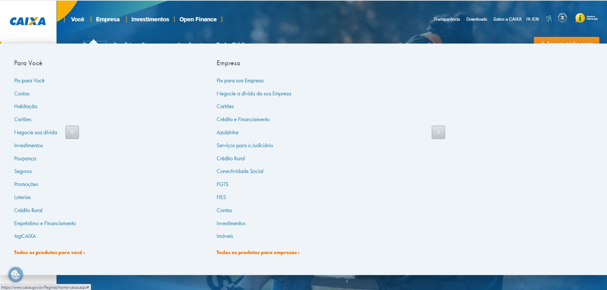

# Análise parcial

## Caixa

No site da Caixa, encontramos uma grande oportunidade para nosso trabalho de refatoração.

## Análise parcial

O site da Caixa foi até um susto para nós do Grupo, pois há uma grande disparidade em relação aos seus concorrentes. É um site quebrado, mal formatado, sem responsividade alguma e com poucas funções de acessibilidade.

No entanto, percebemos que os problemas do site são justamente os desafios que precisamos enfrentar para o nosso projeto. Por isso, decidimos incluir o site da Caixa em nosso escopo de trabalho e nos comprometemos a refatorá-lo para corrigir esses problemas.

### O Site

Fotografia 1 — Pagina inicial site da Caixa
   Fonte: [Site da caixa](https://www.caixa.gov.br/Paginas/home-caixa.aspx)
 
 
Fotografia 2 — Pagina inicial site da Caixa com menu aberto
   Fonte: [Site da caixa](https://www.caixa.gov.br/Paginas/home-caixa.aspx)
 
 

Observando a fotografia 1 e 2, é possível identificar alguns pontos a serem melhorados que foram notados logo na primeira análise do site da Caixa:

* Sobreposição
* Formatação
* Acessibilidade

### Usuários

Por se tratar de um site bancário, possui diversos clientes, uma vez que ter uma conta em um banco não impede o usuário de criar outra conta em outro banco. Temos usuários tanto na faculdade quanto nas famílias e no trabalho, o que torna o acesso aos clientes uma tarefa fácil para o nosso projeto

## Histórico de revisão

| Versão     | Data        | Descrição            | Autor(es)                          | Revisores  |
| :--------: | :---------: | -------------------- | ---------------------------------- | ---------- |
| `0.0`      |  22/04/2023 | Criação do arquivo   | Arthur Trindade           | -          |
| `0.1`      |  24/04/2023 | Adição do site escolhido  | Miguel Moreira | -     |
| `0.2`      |  26/04/2023 | Completando a pagina  | Miguel Moreira | -     |