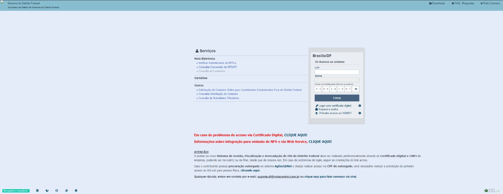

## Introdução

Neste relatório, apresentaremos uma análise parcial do [ISSNetDF](https://df.issnetonline.com.br/online/Login/Login.aspx?ReturnUrl=%2fonline), uma plataforma que oferece serviços de gerenciamento e emissão de notas fiscais eletrônicas para empresas. Originalmente, havíamos selecionado o [site da Caixa Econômica Federal](https://www.caixa.gov.br/Paginas/home-caixa.aspx) como nosso objeto de estudo. No entanto, devido a uma refatoração recente desse site, optamos por mudar para nossa segunda opção, o site da [ISSNetDF](https://df.issnetonline.com.br/online/Login/Login.aspx?ReturnUrl=%2fonline). Essa escolha foi baseada na facilidade de encontrar usuários e na relevância do site para um dos membros do nosso grupo de trabalho.

## Critérios de escolha

Durante o processo de seleção do site para o projeto de IHC, consideramos diversos critérios:

1. **Relevância do setor**: Avaliamos a importância do setor ao qual o site pertence. Optamos por escolher um site que estivesse relacionado a um setor de atividade estratégico ou em destaque, a fim de tornar o projeto mais relevante e alinhado com as tendências do mercado.

2. **Potencial de impacto**: Consideramos o potencial de impacto da refatoração do site. Buscamos escolher um site que, ao ser melhorado em termos de usabilidade e experiência do usuário, pudesse beneficiar um número significativo de pessoas e gerar um impacto positivo.

3. **Disponibilidade de recursos**: Verificamos a disponibilidade de recursos e informações sobre o site. A existência de documentação, dados de uso ou relatórios de problemas poderiam fornecer insights valiosos para o projeto.

4. **Diversidade de funcionalidades**: Consideramos a diversidade de funcionalidades oferecidas pelo site. Optamos por escolher um site que apresentasse uma variedade de recursos e interações, o que proporcionaria uma maior oportunidade de análise e melhoria em diferentes aspectos.

5. **Relevância regional**: Também levamos em conta a relevância regional do site. Optamos por selecionar um site que tivesse um público-alvo mais específico ou uma abrangência geográfica limitada, o que poderia tornar mais viável o recrutamento de usuários para testes e feedback.

6. **Recomendação de um colega**: Um dos critérios de seleção foi o fato de o site ser de trabalho de um colega. Isso facilitaria o acesso aos usuários e a compreensão das necessidades e demandas relacionadas ao site.

7. **Design e usabilidade inadequados**: Consideramos a aparência e usabilidade do site como critérios de seleção. Escolhemos um site que apresentava deficiências em termos de design, layout e experiência do usuário. Isso permitiria que explorássemos melhorias nesses aspectos por meio da refatoração.

## ISSNet

O [ISSNetDF](https://df.issnetonline.com.br/online/Login/Login.aspx?ReturnUrl=%2fonline) é uma plataforma importante que oferece serviços de gerenciamento e emissão de notas fiscais eletrônicas para empresas. É uma ferramenta essencial para a gestão de negócios, utilizada principalmente por empresas e profissionais que trabalham com contabilidade ou departamento financeiro. Durante nossa análise, identificamos diversos aspectos que podem ser aprimorados para melhorar a usabilidade e a experiência do usuário.

### Usuários

O site da [ISSNetDF](https://df.issnetonline.com.br/online/Login/Login.aspx?ReturnUrl=%2fonline) é utilizado principalmente por empresas e profissionais que precisam emitir notas fiscais eletrônicas. Esses usuários são em sua maioria pessoas que trabalham com contabilidade ou departamento financeiro de empresas, o que torna o acesso a esse público uma tarefa fácil para o nosso projeto.

### Aspectos selecionados para o projeto

Ao analisar o site da [ISSNetDF](https://df.issnetonline.com.br/online/Login/Login.aspx?ReturnUrl=%2fonline), identificamos os seguintes aspectos que podem ser aprimorados:

1. Falta de usabilidade: O site não oferece recursos de acessibilidade, como suporte a LIBRAS (Língua Brasileira de Sinais), sensibilidade à luz (contraste adequado) e ajuste do tamanho da fonte. Essas melhorias são cruciais para atender às necessidades de usuários com deficiência auditiva, visual ou cognitiva.
2. Navegação confusa: O site apresenta uma estrutura de navegação complexa, com informações relevantes escondidas em menus pouco intuitivos. É fundamental simplificar a navegação e tornar mais fácil para os usuários encontrar as informações desejadas.
3. Má formatação do conteúdo: O conteúdo do site pode estar mal formatado, dificultando a leitura e a compreensão das informações pelos usuários. É importante garantir uma formatação consistente e clara para melhorar a legibilidade e a eficiência na busca de informações.

### O Site

*Figura 1: Página inicial do site ISSNet*

*Fonte: [ISSNetDF](https://df.issnetonline.com.br/online/Login/Login.aspx?ReturnUrl=%2fonline), 2023*

 
 

Observando a tela inicial do site, figura 1, é possível identificar alguns dos problemas mencionados anteriormente.

## Histórico de revisão

| Versão     | Data        | Descrição            | Autor(es)                          | Revisores  |
| :--------: | :---------: | -------------------- | ---------------------------------- | ---------- |
| `0.0`      |  22/04/2023 | Criação do arquivo   | Arthur Trindade                    | -          |
| `0.1`      |  24/04/2023 | Adição do site escolhido  | Miguel Moreira           | Arthur Trindade |
| `0.2`      |  26/04/2023 | Completando a página  | Miguel Moreira           | Arthur Trindade |
| `0.3`      |  07/05/2023 | Mudança de site e atualização da análise  | Miguel Moreira           | Arthur Trindade |
| `0.4`      |  19/06/2023 | Correções de feedback  | Miguel Moreira           | Arthur Trindade |
| `0.5`      |  03/07/2023 | Atualização de seções e revisão final  | Miguel Moreira           | Arthur Trindade |

